# Task Manager Frontend

Modern Task Manager Frontend built with React.js, Axios, React Router DOM and Tailwind CSS.

React.js, Axios, React Router DOM va Tailwind CSS yordamida qurilgan zamonaviy Task Manager Frontend.

---

# Features | Imkoniyatlar

## Authentication System | Autentifikatsiya tizimi

- User Registration | Foydalanuvchi ro'yxatdan o'tishi
- OTP Verification | OTP tasdiqlash
- Login System | Login tizimi
- JWT Authentication
- Access & Refresh Token
- Protected Routes | Himoyalangan routelar

---

## Task Management | Task boshqaruvi

- Create Task | Task yaratish
- Update Task | Task yangilash
- Delete Task | Task o'chirish
- Update Task Status | Task statusini yangilash
- Todo / In Progress / Done system
- Task Priority System | Priority tizimi

---

## User Management | User boshqaruvi

- Profile Page | Profil sahifasi
- Update Profile | Profilni yangilash
- Change Password | Parolni o'zgartirish
- Users Page (Admin only)
- Delete User (Admin only)

---

# Technologies Used | Ishlatilgan texnologiyalar

## Frontend

- React.js
- React Router DOM
- Axios
- Tailwind CSS

---

## Development Tools

- Vite
- VS Code
- Git
- Postman

---

# Pages | Sahifalar

- Register Page
- OTP Verification Page
- Login Page
- Dashboard Page
- Profile Page
- Users Page

---

# Install Dependencies | Paketlarni o'rnatish

```bash
npm install
```

---

# Run Project | Loyihani ishga tushirish

```bash
npm run dev
```

---

# Screenshots | Screenshotlar

---

## Authentication Pages | Auth sahifalari

### 1. Register Page | Ro'yxatdan o'tish sahifasi


---

### 2. Name Required Validation

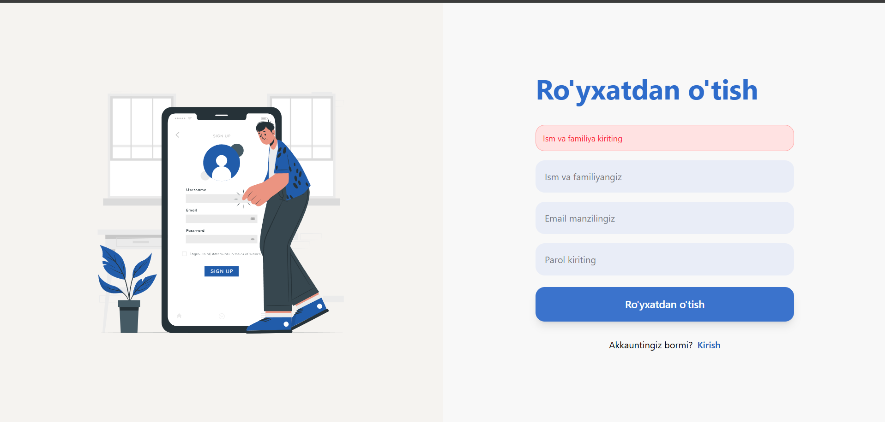

---

### 3. Email Required Validation


---

### 4. Password Required Validation

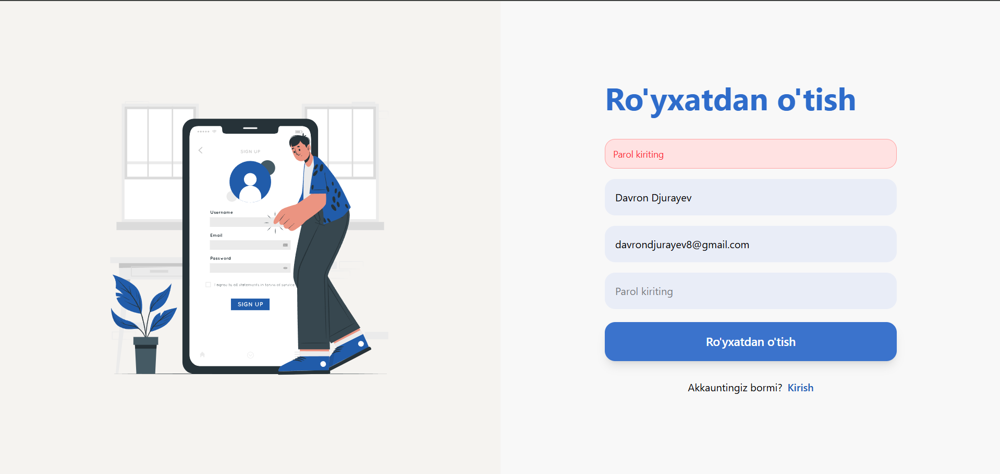

---

### 5. Password Minimum 6 Characters


---

### 6. Fullname Minimum 3 Characters


---

### 7. OTP Verification Page

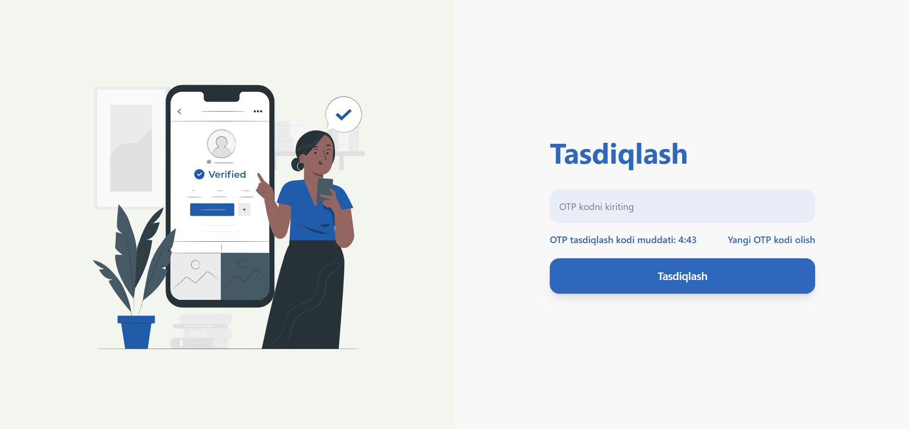

---

### 8. OTP Resent Alert

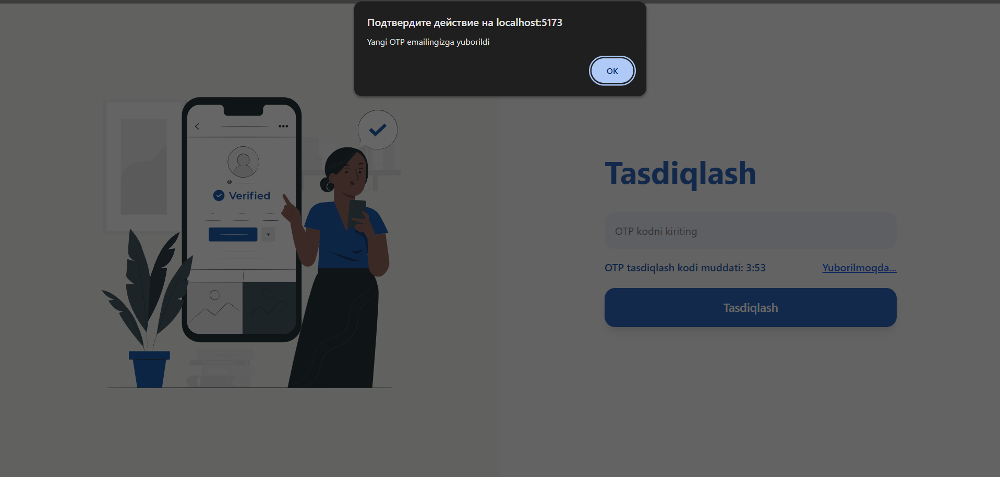

---

### 9. Login Error Page


---

# Dashboard Pages | Dashboard sahifalari

### 10. Empty Dashboard

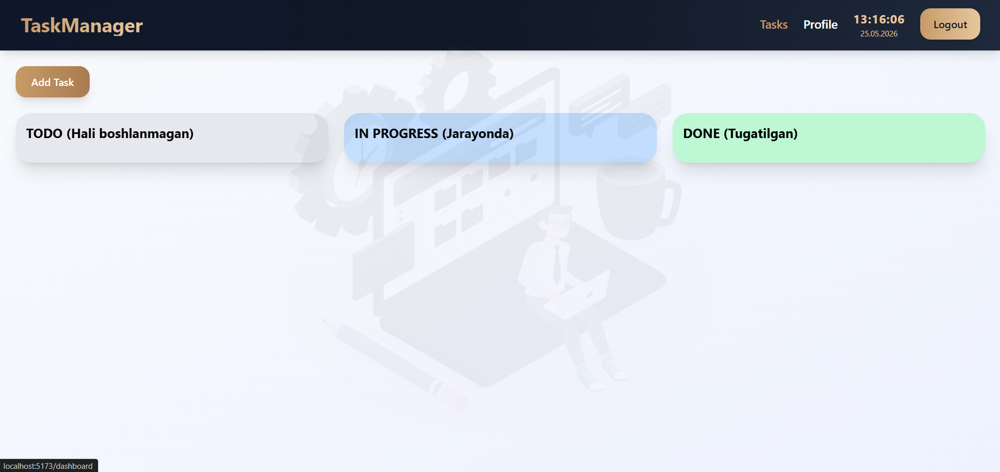

---

### 11. Create Task Modal

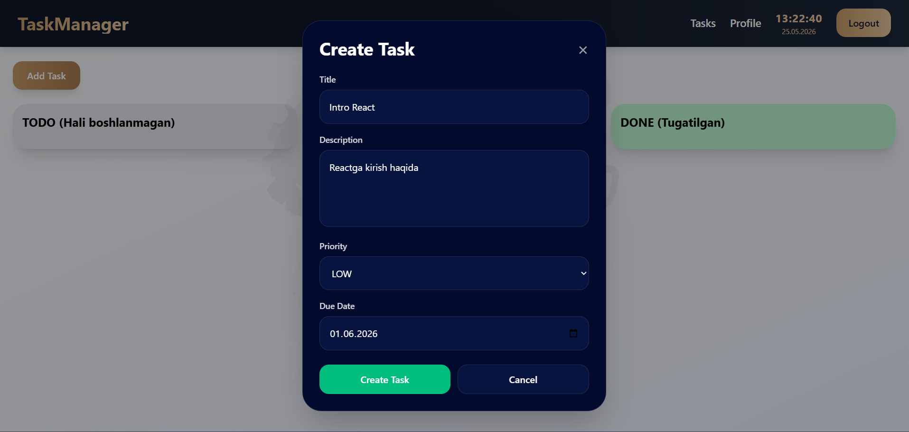

---

### 12. Task Created Alert

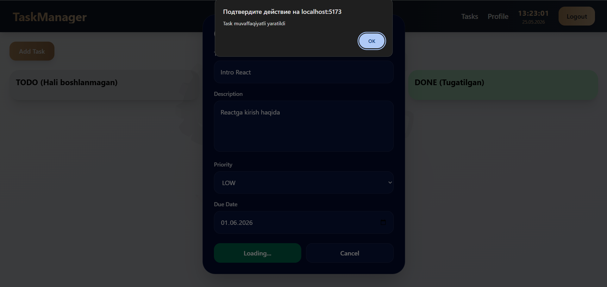

---

### 13. Full Task Dashboard

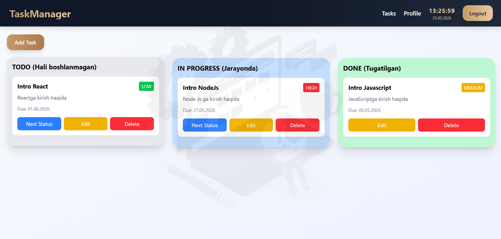

---

### 14. Updated Task Dashboard

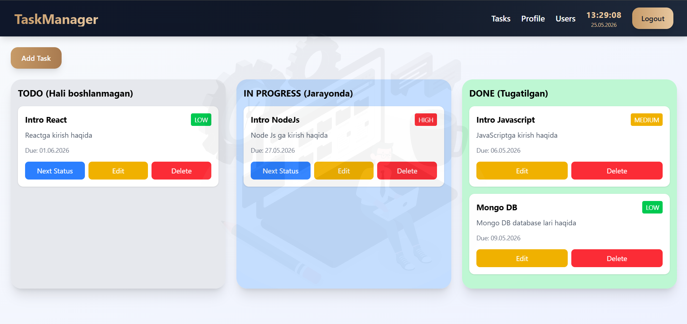

---

# Profile Pages | Profil sahifalari

### 15. User Profile Page


---

### 16. Profile Updated Alert

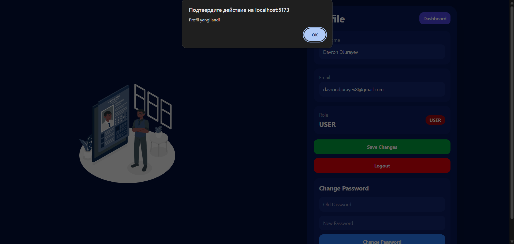

---

### 17. Password Updated Alert

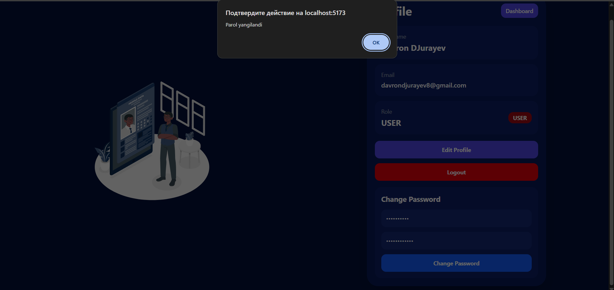

---

### 18. Admin Profile Page


---

# Users Pages | Users sahifalari

### 19. Users Page

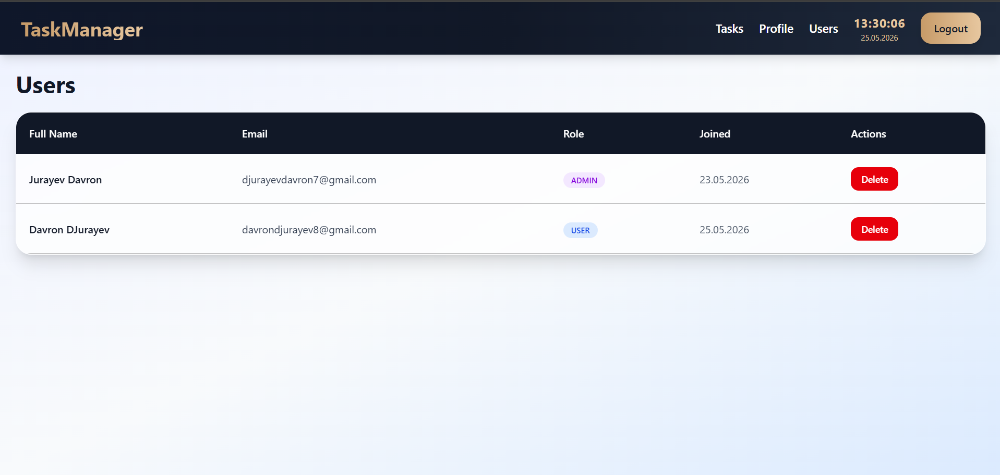

---

### 20. User Delete Confirmation

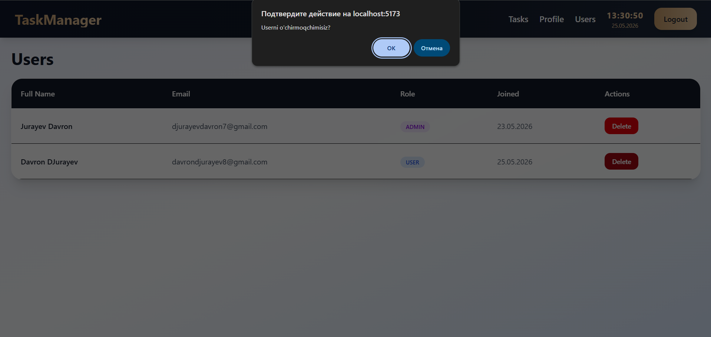

---

# Author | Muallif

## JURAYEV DAVRON